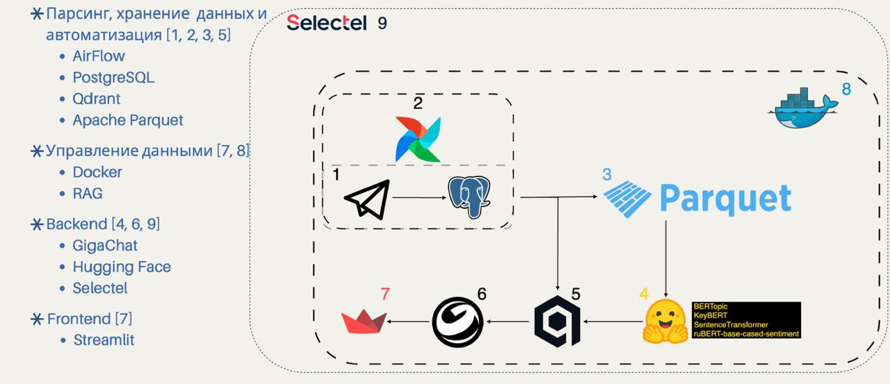
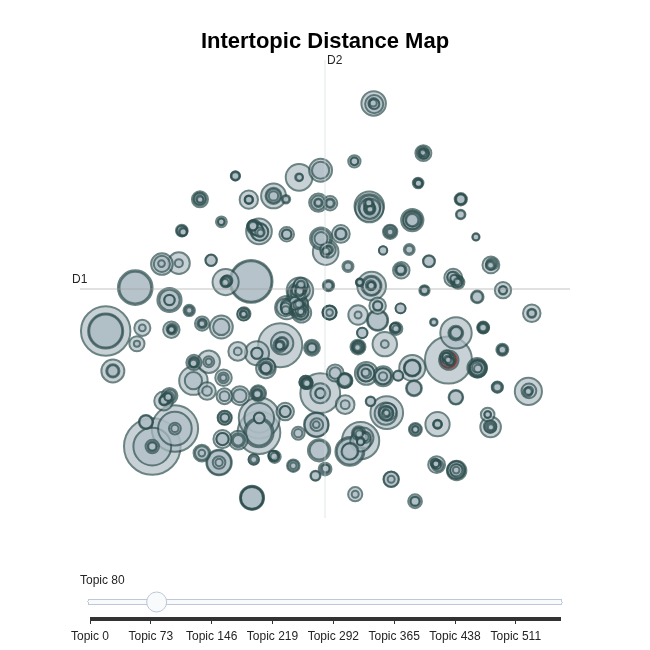

# 🗞️ News RAG · Semantic Search по Telegram

> Мы решаем проблему поиска в Telegram.  
> В Telegram сложно быстро найти нужную информацию по смыслу или теме.  
> Каждый день публикуются тысячи новостей, мнений и аналитики — но понять тренды и реакцию людей почти невозможно без "думскроллинга".  
>
> News RAG помогает находить и понимать Telegram-посты по смыслу, теме и эмоциональному фону.

---

## 🚀 Архитектура проекта

  

Проект построен как полный ML-пайплайн, от сбора данных до интерактивного веб-приложения.

### 🔹 Основные этапы

| Этап | Описание |
|------|-----------|
| 1. Data Collection | Новости парсились из Telegram — собрано около 80 000 сообщений из 12 каналов: 5 IT/технологических, 4 новостных, 2 экономических и 1 развлекательный. Все посты сохранялись в PostgreSQL, а процесс был автоматизирован через Airflow. |
| 2. Data Cleaning | Проведена большая работа по очистке данных: удалены эмодзи, ссылки, водяные знаки, дубли. После очистки данные были сохранены в формате Parquet для дальнейшего анализа. |
| 3. Sentiment & Keywords | Использованы модели из HuggingFace: ruBERT для определения тональности (sentiment) и KeyBERT для выделения ключевых слов. Результаты добавлены в отдельные столбцы базы данных. |
| 4. Embeddings & Qdrant | С помощью SentenceTransformer созданы векторные представления сообщений, которые были загружены в Qdrant — векторную базу данных для семантического поиска. |
| 5. BERTopic Clustering | На эмбеддингах обучена BERTopic, которая автоматически группирует посты по темам (*технологии, экономика, политика, наука* и др.). |
| 6. RAG Pipeline | Построен RAG-пайплайн на основе GigaChat (ранее использовался OpenAI, но заменён из-за региональных ограничений). RAG обращается к двум векторным базам: сначала ищет по темам, затем уточняет ответ в основной базе постов, повышая точность результата. |
| 7. Streamlit & Deployment | Веб-интерфейс реализован на Streamlit: поиск, фильтры, визуализации и экспорт данных. Всё обёрнуто в Docker и развёрнуто на сервере Selectel. |

---

## 🧠 Пример анализа (UMAP эмбеддингов)

  

На графике показана кластеризация Telegram-постов по смыслу (UMAP).  

---
## 🧭 Будущее развитие
 - 🧰 Автоматизировать все процессы (ETL, обновления, анализ)
 - 📦 Сделать коробочное решение для локальной установки
 - 🌍 Добавить поддержку нескольких языков
 - 💡 Улучшить модель RAG-ответов и объяснимость поиска

## Авторы
- Кошелев Дмитрий
- Пахомов Ярослав

Проект создан как multi-platform NLP по анализу Telegram-контента
и исследованию трендов в открытых источниках
